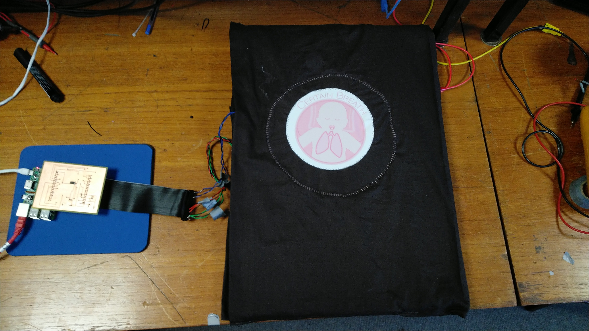

# Certain Breath

## Introduction

Certain Breath is a device developed to help combat the problem of [Sudden Infant Death Syndrome (SIDS)](https://en.wikipedia.org/wiki/Sudden_infant_death_syndrome). Unexplained deaths from SIDS occur at a rate of up to 1 in 1000 infants aged mostly from 28 days to 1 year.

With a wide range of available electronic sensors and the worldwide spreading of internet of things (IoT), hobbyists are now equipped to build their own embedded projects, whether it's for convenience (see [app controlled garage door](https://www.amazon.co.uk/OWSOO-Controller-Compatible-Control-Function/dp/B07FM6HMZ6)), for increased productivity (see [real-time in-ear translator](https://github.com/steven-king/660-storytelling-vr/wiki/Emerging-Tech:-Pilot)) or for fun (see [lightening detector](http://runtimeprojects.com/2016/02/a-lightning-detector-for-arduino/)).

With Certain Breath we aim to create a simple real-time application to tackle SIDS. Through these pages we provide a comprehensive guide of desiging and building your own baby monitor using the Raspberry Pi.

## Device functionality

Certain Breath is a infant sleeping monitor that tracks the respiratory rate and body temperature of the infant using high-sensitivity force sensors. The data is collected and analysed locally and sent off for external (dev/ web application) visualisation. Parents and people nearby are notified of any abnormalies in the respiratory functions through push-notifications and local means (i.e. LEDs or sound). 

See our [wiki](https://github.com/tmpabc/certainbreath/wiki/) for more information
## Quick links

1) [Part list](https://github.com/tmpabc/certainbreath/wiki/Component-List)  
2) [Main functionalities](https://github.com/tmpabc/certainbreath/wiki/Device-Functionality)  
3) [Monitor webpage](http://certainbreath.herokuapp.com)  

